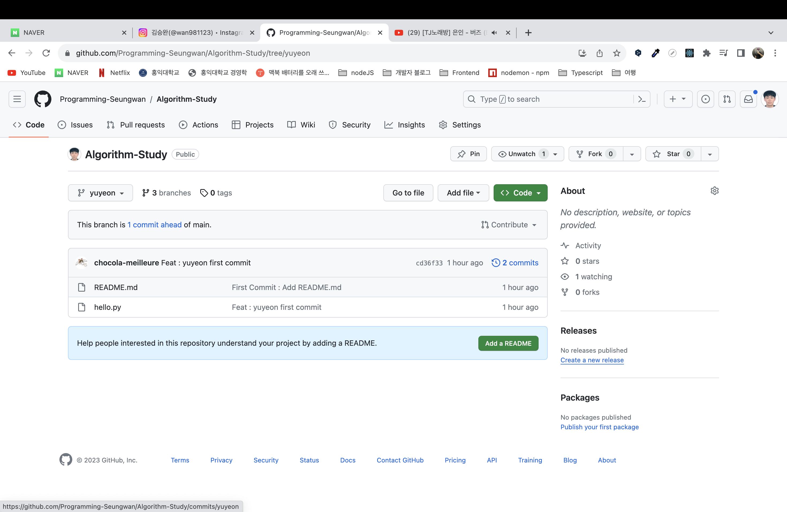
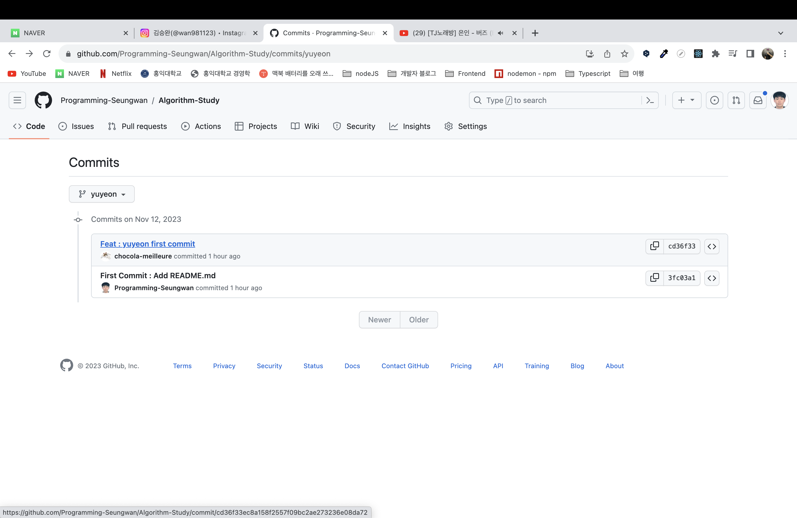
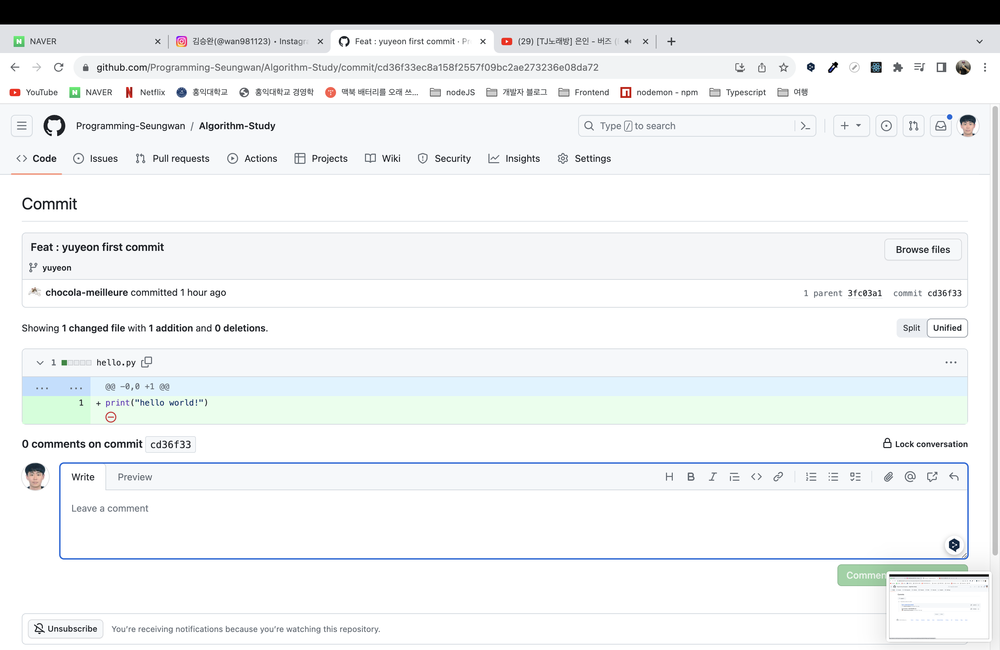
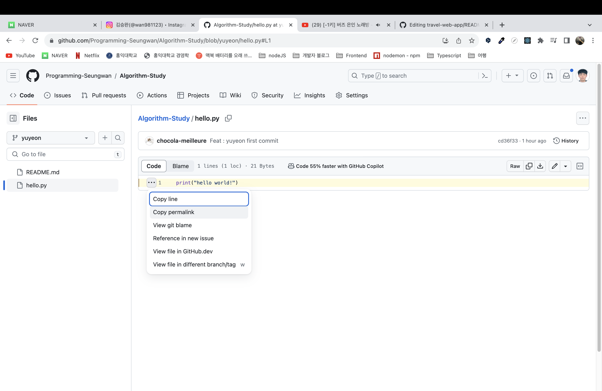
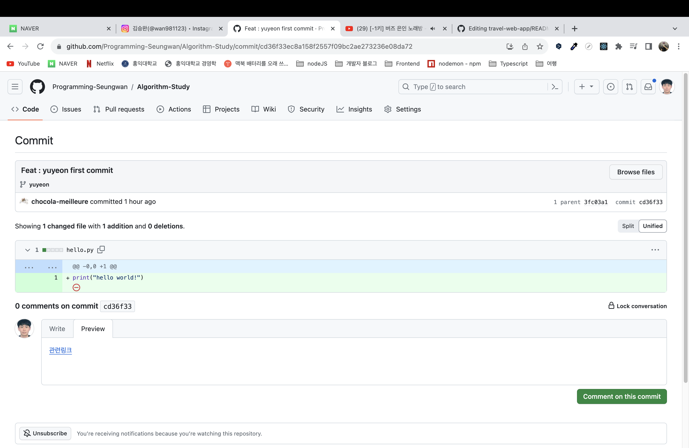

# 알고리즘 Github Repository 사용법 📝

알고리즘 깃허브 레포지터리에 대한 활용 방법은 다음과 같습니다.

- 각자의 브랜치를 활용합니다. 새롭게 스터디에 참여하시는 분들은 레포지토리의 collaborator로 초대 받으신 뒤 본인의 브랜치를 생성하시고 해당 브랜치에 본인 로컬 레포지토리의 코드를 `push` 하시면 됩니다
- Github 원격 레포지토리의 **main** 브랜치에 원하는 진행 방식, 코드 리뷰 방식이 있으시다면 팀원들과 상의하신 후 리드미 문서를 작성하거나 관련 파일을 `push` 해주시면 됩니다.
- 다른 팀원의 브랜치에는 `push`하지 않도록 최대한 주의해주시면 됩니다.

## 목차

- [코드 리뷰 방법](#코드-리뷰-방법-📌)
  - [코드 리뷰 권장 사항](#코드-리뷰-권장-사항-👣)
- [코드 commit 및 레포지터리 이용 컨벤션](#코드-commit-및-레포지터리-이용-컨벤션-🙏🏼)

## 코드 리뷰 방법 📌

팀원의 코드를 리뷰할 때에는 해당 팀원의 브랜치 --> 커밋 내역에 들어가서 comment를 다는 방식으로 진행합니다. 관련 이미지를 하단에 첨부하겠습니다.



> 특정 팀원의 Github 내의 Branch로 들어가서 커밋 내역을 누릅니다(이미지 내 2 commits라고 적힌 부분)



> 해당 팀원의 커밋 내역을 클릭합니다(각 커밋은 특정 문제를 의미)



> 해당 팀원이 푼 문제의 코드에 comment로 리뷰를 남깁니다.

### 코드 리뷰 권장 사항 👣

1. 단순히 코드가 좋아요~ 방식의 리뷰보다는 좋았다면 어떤 점이 알고리즘적으로 왜 좋은지를 중심으로 평가합시다.
2. 마크다운 문법상에서는 백틱 1개를 2번 쓰면 짧은 코드 스니펫, 3개를 2번 쓰면 그 사이에 긴 코드 스니펫을 남길 수 있습니다. 더 좋은 코드가 있다면 적극적으로 활용하여 팀원에게 알려줍시다.
3. 팀원이 남긴 코드를 단순히 읽어보는 식이 아닌, 피드백을 남겨 서로 성장할 수 있는 계기가 됐으면 좋겠습니다.
4. 백틱 사용하여 코드 스니펫을 남겨도 좋지만 특정 팀원에게 공유하고 있는 코드 레퍼런스가 있다면, 이를 링크로 공유해도 좋을 것 같습니다. 방식은 다음과 같습니다.


> 레퍼런스로 활용하고 싶은 특정 팀원의 Github 내의 브랜치로 이동합니다.



> Github 내의 원하는 파일이 위치한 path로 이동하여 해당 코드의 permalink를 복사합니다.



> 다음과 같은 방식을 통하여 링크를 첨부하면 다른 사람이 링크를 클릭하여 해당 코드로 쉽게 이동할 수 있습니다.
> `[관련링크](https://github.com/Programming-Seungwan/Algorithm-Study/blob/cd36f33ec8a158f2557f09bc2ae273236e08da72/hello.py#L1)`

## 코드 commit 및 레포지터리 이용 컨벤션 🙏🏼

각 팀원들이 공유되는 컨벤션을 잘 지켜준다면 서로 리뷰를 하는 데에 도움이 될 것 같습니다.

1. 로컬 레포지터리에 매주 해당 주차의 디렉터리를 만들어줍시다. 예를 들면 Week1과 같은 이름으로요!
2. 특정 날짜를 파일의 이름으로 정해줍시다. 예를 들면 `20231113.js` 나 `20231113.py`와 같은 방식이면 됩니다.
3. 문제를 풀이한 파일에는 주석으로 해당 주석으로 해당 문제의 이름과 링크를 첨부해줍니다.

```javascript
// 요격 시스템 문제
// https://school.programmers.co.kr/learn/courses/30/lessons/181188

function solution() {
  const result = 0;
  // 해당 문제의 풀이 로직이 위치
  return result;
}
```

```python
# 요격 시스템 문제
# https://school.programmers.co.kr/learn/courses/30/lessons/181188
// 문제에 대한 파이썬 코드
```

4. 다들 잘 알고 계시겠지만, 다른 팀원의 레포지터리를 건드리지 않기 위해 git 명령어를 첨부합니다.

> `git add .` 해당 코드는 문제를 풀이하는 루트 디렉터리에서 입력되어야 스테이징 area로 관련 파일들이 전부 넘어가니 주의합시다.<br/> <br/> `git commit -m "{}"` 의 방식으로 커밋 메시지를 작성해줍시다. 커밋 메시지의 컨벤션은 다음과 같습니다.<br/> <br/>{날짜} {문제이름} 알고리즘 문제풀이, 예를 들면 `20231112 요격 시스템 알고리즘 문제풀이`와 같습니다.<br/> <br/>`git push {로컬 환경에서 인식하는 원격 레포지터리의 이름} {로컬 레포지터리에서의 브랜치명}:{Github 원격 레포지터리 상에서의 브랜치명}` 과 같은 명령어를 통해 Push 해줍시다. 예시는 다음과 같습니다.<br/> <br/>`git push origin seungwanLocal:seungwanRemote` 해당 명령어에서 `origin`은 원격레포지토리의 이름, `seungwanLocal`은 로컬 레포지터리 내의 브랜치명, `seungwanRemote`는 원격 레포지터리 내의 브랜치명입니다.
